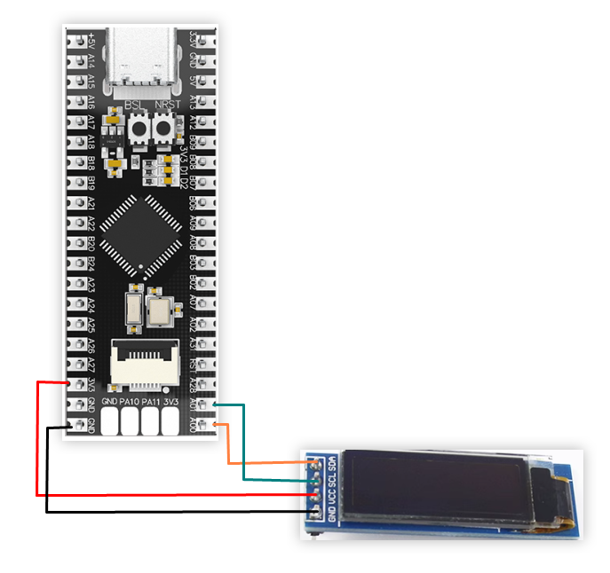
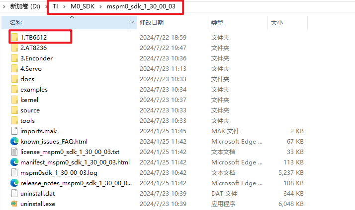

## 0.91-inch OLED screen

### 1. Learning objectives

Print characters through the OLED screen.

### 2. Hardware connection

0.91-inch OLED and MSPM0G3507 wiring



### 3. Program description

- oled.h

```
#ifndef _oled_h_
#define _oled_h_

#include <stdint.h>
#define OLED_ADDRESS 0x3c

void I2C_Configuration(void);
void I2C_WriteByte(uint8_t addr,uint8_t data);
void WriteCmd(unsigned char I2C_Command);
void WriteData(unsigned char I2C_Data);
void OLED_Init(void);
void OLED_SetPos(unsigned char x,unsigned char y);
void OLED_Fill(unsigned char Fill_Data);
void OLED_CLS(void);
void OLED_ON(void);
void OLED_OFF(void);
void OLED_ShowStr(unsigned char x,unsigned char y,unsigned char ch[],unsigned char TextSize);

#endif
```

Define the header file for i2c transmission and oled display

- oled.c

```
void OLED_ShowStr(unsigned char x,unsigned char y,unsigned char ch[],unsigned char TextSize)
{
		unsigned char c = 0,i = 0,j = 0;
		
		switch(TextSize)
		{
			case 1:
			{
					while(ch[j] != '\0')
					{
							c = ch[j] - 32;
							if(x>126)
							{
									x = 0;
									y++;
							}
							
							OLED_SetPos(x,y);
							
							for(i=0;i<6;i++)
							{
									WriteData(F6x8[c][i]);
							}
							x+=6;
							j++;
					}
			}
			break;
			
			case 2:
			{
					while(ch[j] != '\0')
					{
							c = ch[j] - 32;
							
							if(x>120)
							{
									x = 0;
									y++;
							}
							
							OLED_SetPos(x,y);
							
							for(i=0;i<8;i++)
							{
									WriteData(F8X16[c*16+i]);	
							}
							
							OLED_SetPos(x,y+1);
							
							for(i=0;i<8;i++)
							{
									WriteData(F8X16[c*16+i+8]);
							}
							x+=8;
							j++;		
					}
			}
			break;
		}
}

//填充整个屏幕	Fill the entire screen
void OLED_Fill(unsigned char Fill_Data)
{
		unsigned char m,n;
		
		for(m=0;m<8;m++)
		{
				WriteCmd(0xb0+m);
				WriteCmd(0x00);
				WriteCmd(0x10);
				
				for(n=0;n<128;n++)
				{
						WriteData(Fill_Data);
				}
		}
}

```

 Implement oled display characters and screen filling function

- delay.h

```
#ifndef _DELAY_H
#define _DELAY_H

#include <stdint.h>
#include "ti_msp_dl_config.h"

void delay_us(unsigned long __us);
void delay_ms(unsigned long ms);


#endif
```

Define millisecond and microsecond function header files

- delay.c

```
#include "delay.h"

volatile unsigned int delay_times = 0;

//搭配滴答定时器实现的精确us延时	Accurate us delay with tick timer
void delay_us(unsigned long __us) 
{
    uint32_t ticks;
    uint32_t told, tnow, tcnt = 38;

    // 计算需要的时钟数 = 延迟微秒数 * 每微秒的时钟数
	//The number of clocks required for calculation = the number of microseconds of delay * the number of clocks per microsecond
    ticks = __us * (32000000 / 1000000);

    // 获取当前的SysTick值
	//Get the current SysTick value
    told = SysTick->VAL;

    while (1)
    {
        // 重复刷新获取当前的SysTick值
		//Repeatedly refresh to get the current SysTick value
        tnow = SysTick->VAL;

        if (tnow != told)
        {
            if (tnow < told)
                tcnt += told - tnow;
            else
                tcnt += SysTick->LOAD - tnow + told;

            told = tnow;

            // 如果达到了需要的时钟数，就退出循环
			//If the required number of clocks is reached, exit the loop
            if (tcnt >= ticks)
                break;
        }
    }
}
//搭配滴答定时器实现的精确ms延时
//Accurate ms delay with tick timer
void delay_ms(unsigned long ms) 
{
	delay_us( ms * 1000 );
}

//滴答定时器中断处理	Tick timer interrupt handling
void SysTick_Handler(void)
{
	if(delay_times != 0)
	{
		delay_times--;
	}
}
```

Achieve millisecond and microsecond delays through timer counting

- empty.c

```
int main(void)
{	
	SYSCFG_DL_init();
	OLED_Init();	//oled初始化		OLED initialization
//	OLED_Fill(0xFF);//填充白色		Fill with white
	OLED_Fill(0x00);//黑屏			Black screen
	
	while(1)
	{
		OLED_ShowStr(0,0,"Hello world!!",2);//oled显示hello world！！	oled displays hello world! !
		OLED_ShowStr(0,3,"yahboom !",2);//oled显示yahboom ！				oled display yahboom!
	}
}

```

Initialize the oled screen and display the preset characters.

**Note: The project source code must be placed in the SDK path for compilation,**

**For example, the path: D:\TI\M0_SDK\mspm0_sdk_1_30_00_03\1.TB6612**




### 4. Experimental phenomenon

After burning the program to MSPM0G3507 and connecting the wires according to the wiring diagram. After powering on, the OLED will display "Hello world!! "yahboom!"